# Data Visualization.
เป็นการสร้าง Dashboard เพื่อดูค่าที่รับมาจาก server โดยใช้ **_"Grafana"_** ร่วมกับ plugin ที่ชื่อว่า **_"FlowCharting"_**
ซึ่งช่วยในการออกแบบและสร้างแผนผังสถานที่เพื่อให้ Dashboard ดูสวยงามและดูง่ายยิ่งขึ้น ในการสร้างผังสถานที่เราจะสร้างผ่าน **_"Draw.io"_**

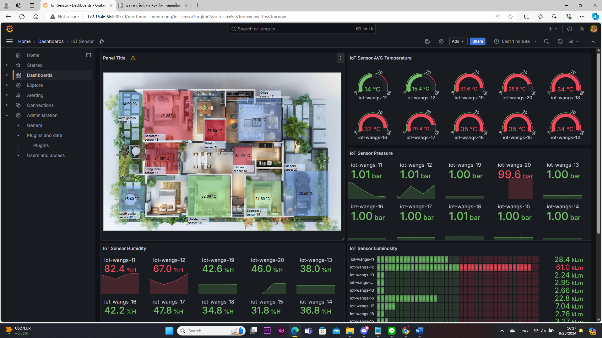
</br> 

จากภาพเรานำเสนอข้อมูลที่ได้รับจาก server มาแสดงผ่าน Grafana โดยใช้กราฟหลายรูปแบบ มีดังนี้
### 1. Map Chart

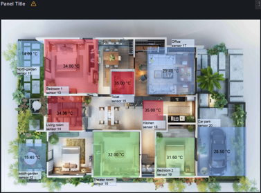
ใช้ในการนำเสนอค่า sensor ทั้ง 10 ตัวให้เห็นภาพได้ง่ายขึ้นโดยในที่นี้เราใช้ map บ้านเพื่อแสดงแผนผังห้องพร้อมข้อมูลอุณหภูมิในแต่ละโซนภายในบ้าน การใช้ Map Graph เพื่อให้เห็นความแตกต่างของอุณหภูมิในแต่ละโซนได้ง่ายขึ้นและง่ายต่อการนำเสนอ
</br> 
### 2. Gauge Chart
 
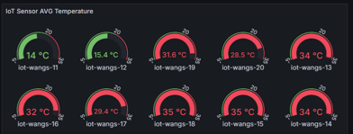
ใช้ในการแสดงค่าอุณหภูมิของเซ็นเซอร์เพื่อให้เห็นค่าแบบละเอียดและบอกได้ทันทีว่าค่าอยู่ในช่วงปกติหรือไม่ เกจนี้จะแบ่งเป็นส่วนต่างๆ โดยใช้สี เช่น สีเขียวบอกว่าค่าปกติ และสีแดงบอกว่าค่าผิดปกติหรือต่ำกว่าหรือเกินค่ามาตรฐาน
</br> 
### 3. Bar Chart
 

ใช้สำหรับแสดงค่าความสว่างของเซ็นเซอร์ในแต่ละโซน การใช้กราฟแท่งช่วยให้ผู้ใช้เห็นปริมาณแสงในห้องแต่ละห้องได้ง่ายขึ้น และสามารถนำไปเปรียบเทียบระหว่างโซนต่างๆ ได้ง่ายขึ้น
</br> 
### 4. Line Chart
 
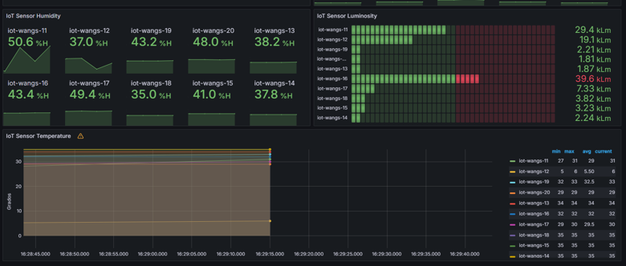
ใช้ในการแสดงข้อมูลการเปลี่ยนแปลงของค่าต่างๆ โดยใน Grafana ใช้ในการแสดงค่า ความดัน และ อุณหภูมิ ซึ่งกราฟเส้นจะช่วยให้เห็นแนวโน้มของค่าในช่วงเวลาที่กำหนด เหมาะกับการมอนิเตอร์ความผันผวนของข้อมูลได้

# Install flowcharting

### **_1. Mount Volumn ใน Grafana เพื่อเก็บ plugins_**

สิ่งแรกที่ต้องทำ คือ การ mount volumn ของ container ให้ถูกต้อง เพื่อป้องกันไม่ให้ plugin ที่เรากำลังจะลงหายไปเวลาเราสั่ง down container 
- เปิดการรองรับ Angular UI แต่ไม่แสดงการเตือนเกี่ยวกับการเลิกใช้งาน Angular UI ใน Grafana โดยเพิ่ม 
    - GF_SECURITY_ANGULAR_SUPPORT_ENABLED=True
    - GF_FEATURE_TOGGLES_ANGULARDEPRECATIONUI=False

```yml
grafana:
    image: grafana/grafana:latest-ubuntu
    container_name: grafana
    user: '0'
    volumes:
      - ./grafana/data:/var/lib/grafana
      - ./grafana/dashboards:/etc/grafana/provisioning/dashboards
      - ./grafana/datasources:/etc/grafana/provisioning/datasources
      - ./grafana/data/plugins:/var/lib/grafana/plugins
     
    environment:
      - GF_SECURITY_ADMIN_USER=${ADMIN_USER:-admin}
      - GF_SECURITY_ADMIN_PASSWORD=${ADMIN_PASSWORD:-admin}
      # - GF_INSTALL_PLUGINS=grafana-clock-panel,grafana-worldmap-panel,grafana-piechart-panel
      - GF_USERS_ALLOW_SIGN_UP=false
      - GF_SECURITY_ANGULAR_SUPPORT_ENABLED=True
      - GF_FEATURE_TOGGLES_ANGULARDEPRECATIONUI=False
    restart: unless-stopped
    links:
       - prometheus
    ports:
      - '8085:3000'
```
เมื่อ mount volumn เสร็จแล้วให้ save และ run grafana ใหม่

 ```bash
 docker compose up grafana
```
</br>

### **_2. ติดตั้ง FlowCharting_**

#### 1. cd เข้าไปใน plugin directory

```bash
cd /var/lib/grafana/plugins
```

#### 2. สร้าง directory มา 1 directory ด้วยชื่ออะไรก็ได้ เพื่อเก็บ plugin file ที่เราจะทำการ get และ cd เข้าไป

```bash
mkdir src
cd src
```

#### 3. โหลด plugin โดยการใช้ wget ตามด้วยลิงค์ zip file
- plugin มาจาก https://github.com/skyfrank/grafana-flowcharting/releases/tag/v1.0.0e
- click ขวา copy link address ของ agenty-flowcharting-panel-1.0.0e.231214594-SNAPSHOT.zip

```bash
wget https://github.com/skyfrank/grafana-flowcharting/releases/download/v1.0.0e/agenty-flowcharting-panel-1.0.0e.231214594-SNAPSHOT.zip
```

- สำหรับใครที่ใช้ wget ไม่ได้ให้ 

```bash
sudo apt-get update
sudo apt-get install wget
```

#### 4. extract zip file ด้วยการใช้ unzip

```bash
unzip agenty-flowcharting-panel-1.0.0e.231214594-SNAPSHOT.zip
```

#### 5. move dist folder to grafana-flowcharting-panel

```bash
mv dist ../grafana-flowcharting-panel
```

#### 6. แก้ไขให้ grafana รองรับ angular plugin ได้เนื่องจาก grafana เวอร์ชั่นใหม่ ๆ ไม่รองรับแล้ว แต่เราแก้ไขได้

- เข้าไปใน container ของ grafana

```bash
docker exec -it grafana /bin/bash
```
- ไปที่ path /etc/grafana

```bash
cd /etc/grafana
```

- แก้ไขไฟล์ grafana.ini

```bash
vim grafana.ini
```

- หา keyword คำว่า angular โดยการใช้ 

```bash
/angular
```

- แก้ไขให้เป็น true

```bash
angular_support_enabled = true
```
</br>

**หลังจากทำเสร็จสิ้นแล้วให้ออกมาจาก container ของ grafana และ restart grafana**

```bash
docker compose restart grafana
```

**จากนั้นก็เข้าไปใน grafana ผ่าน browser เพื่อตรวจสอบว่ามี plugin ชื่อ FlowCharting ติดตั้งแล้วหรือยัง ถ้ามีแสดงว่าติดตั้งสำเร็จแล้ว**

</br>
</br>

# การใช้งาน FlowCharting
</br>

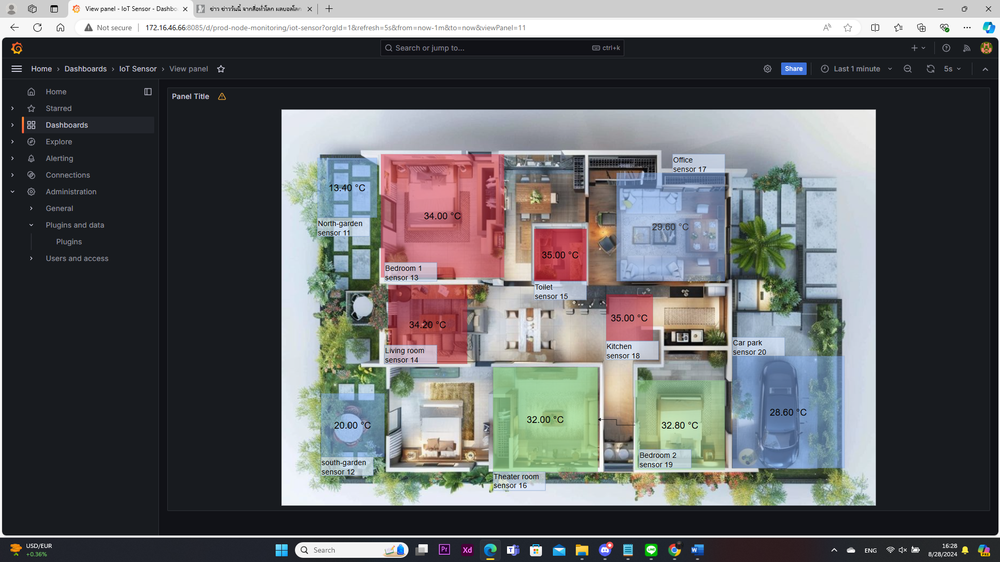
</br>


ออกแบบ chart ตามต้องการผ่าน drawio ในที่นี้ได้ใช้แผนผังบ้านซึ่งเราจะวาง sensors 10 ตัวสำหรับรับค่าอุณหภูมิจาก sensor มาแสดงที่ dashboard
1. เริ่มจากการดึง plugin flowcharting ที่ install ข้างต้นมาใช้งานโดยกด add ที่มุมขวาบนแล้วค้นหาคำว่า flowcharting
</br>

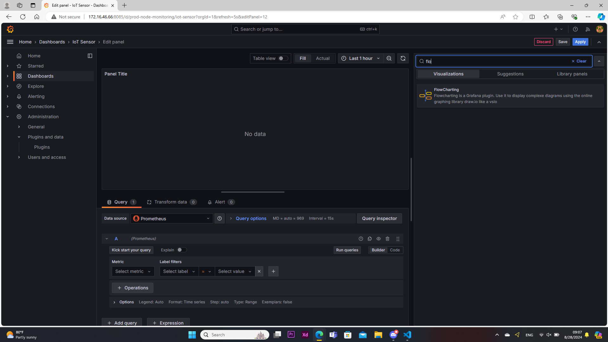
</br> 

2. เมื่อเข้ามาที่ flowcharting เราสามารถ edit diagram เพื่อแก้ไขแผนผังหน้า dashboard ได้ตามที่ต้องการโดยแก้ chart ผ่าน drawio
</br>


</br> 

3. ออกแบบแผนผังใน drawio ตามความต้องการ ในที่นี้เราใช้เป็นภาพแผนผังบ้าน
</br>

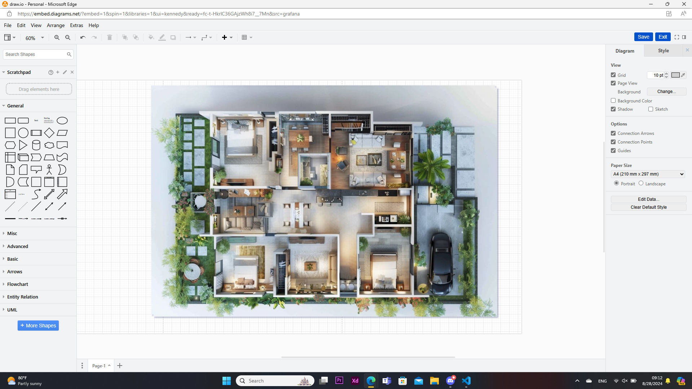
</br> 

4. สร้างกล่องใสขึ้นมาเตรียมไว้สำหรับแสดงค่าอุณหภูมิของ sensors ทั้ง 10 ตัวกระจายทั่วบ้านและเราสามารถเขียนอธิบายได้ว่า sensors นั้นอยู่ที่ไหนชื่ออะไรโดยสร้างอีกกล่องข้อความมาเขียนคำอธิบาย ซึ่งเราสามารถปรับขนาด สี ของข้อความได้ตามที่เราต้องการ เมื่อสร้างเสร็จแล้วให้กด save
</br>

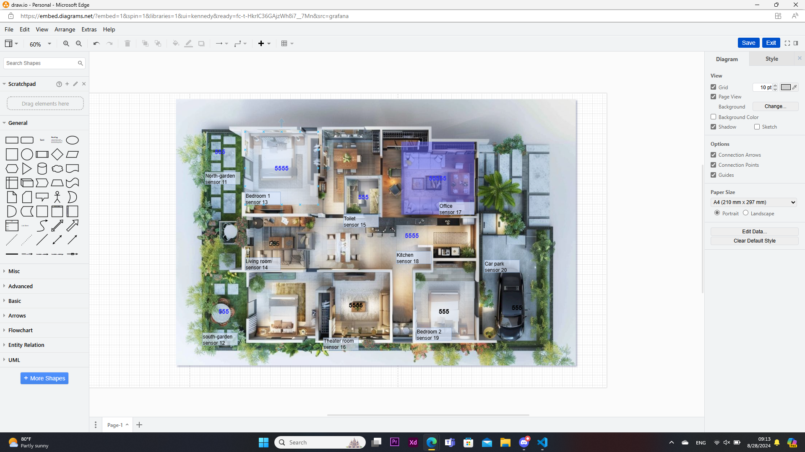
</br> 

5. รับค่า sensor มาแสดงบน drawio ที่สร้างผ่าน Prometheus ทำให้เราสามารถ query ค่าออกมาใช้งานได้ 
    - เลือก Data source เป็น Prometheus เพราะเราใช้ Prometheus ในการดึง streaming data
      </br>

      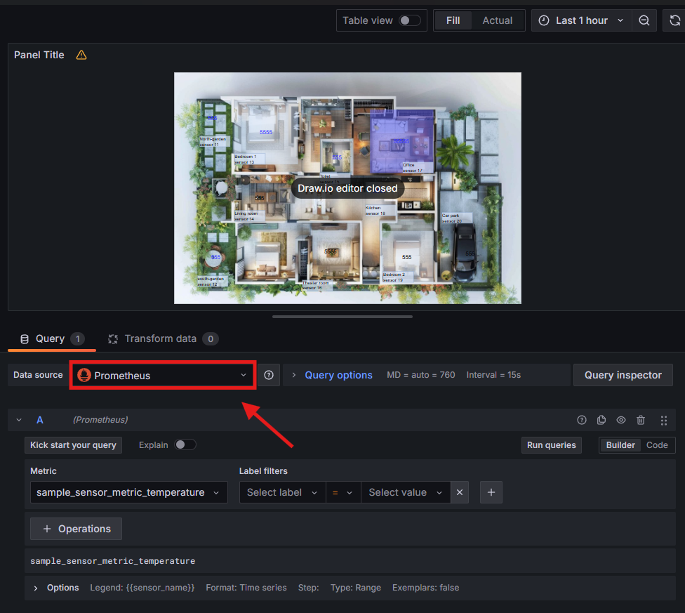
      </br> 

    - เลือก select metric เป็นค่าที่เราอยากใช้มาแสดง ในที่นี้เราจะใช้ค่า sample_sensor_metric_temperature
      </br>

      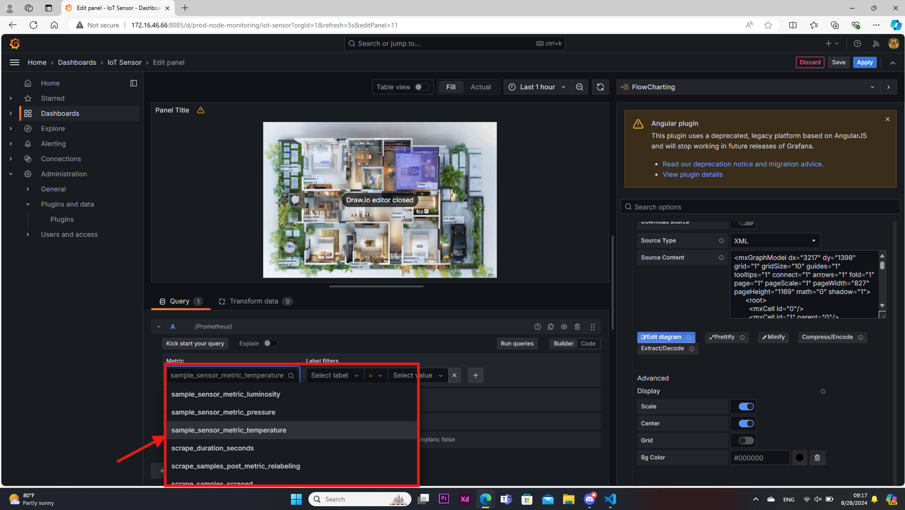
      </br> 

    - เลือก key ที่ต้องการมาแสดงใน options โดยในที่นี้เราจะเลือกเป็น sensor_name
      </br>

      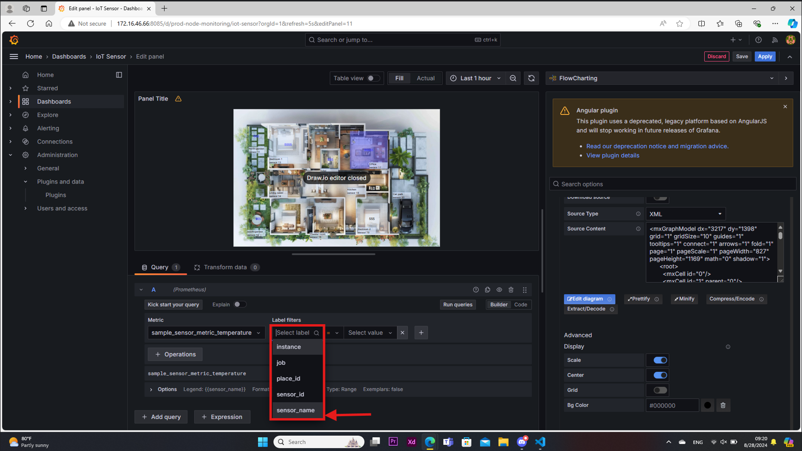
      </br> 
    - จากนั้นกด run request
      </br>

      
      </br> 

6. map ค่าระหว่างกล่องโปร่งใสที่สร้างกับ sensor
    </br>

    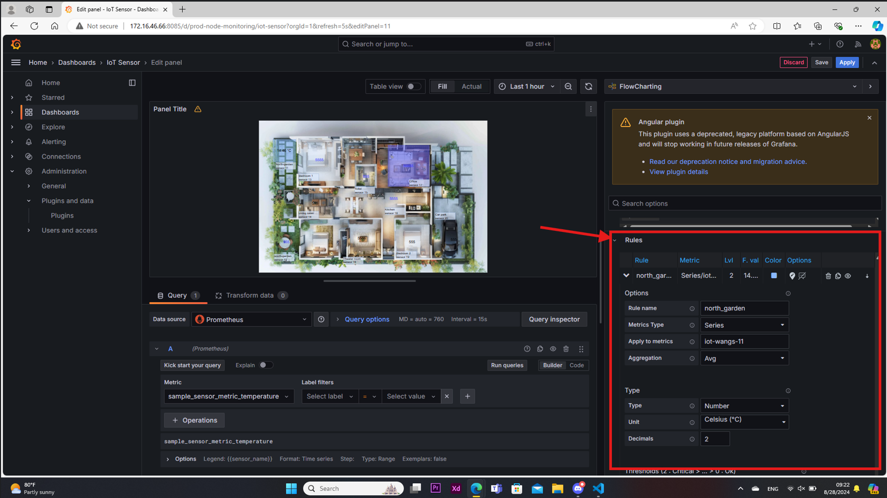
    </br> 

    - ไปที่ Rules
    - เลือกค่าที่ต้องการแสดง apply to metrics โดยเลือกตามค่าที่เราทำการ query มา
    - เราสามารถกำหนด หน่วย ได้ ในหัวข้อ type (unit)
    - เลือกประเภทของค่าเป็น AVG เพื่อให้ค่าแสดงผลตรงกับ plugins อื่น ๆ ที่มีอยู่แล้วบน dashboard
    - ในหัวข้อ map color และ map text แล้วกดสัญลักษณ์ location จากนั้นให้กดไปที่กล่องใสที่เราสร้างไว้ใน drawio ที่ต้องการเพื่อแสดงค่า sensor ถ้าทำสำเร็จจะขึ้นแสดงว่าเราได้ทำการกดเลือกตรงไหนเพื่อแสดงค่า
      </br>

      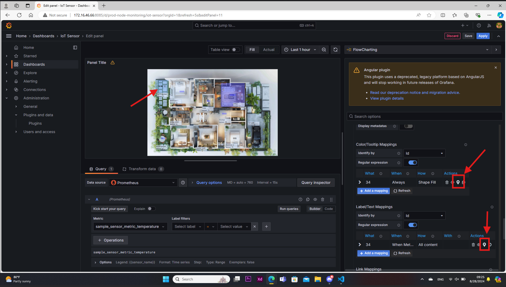
      </br> 

    - จะเห็นได้ว่าสีและค่าที่ query มาได้ขึ้นไปอยู่บนกรอบแผนผัง drawio ที่เราสร้างไว้
    - เราสามารถกำหนดค่า treshold ของสีได้ ถ้าค่าอยู่ใน range นี้จะให้กล่องมีสีอะไร เช่น หากค่าอุณหภูมิ <= 30 ให้แสดงสีฟ้าเป็นต้น
      </br>

      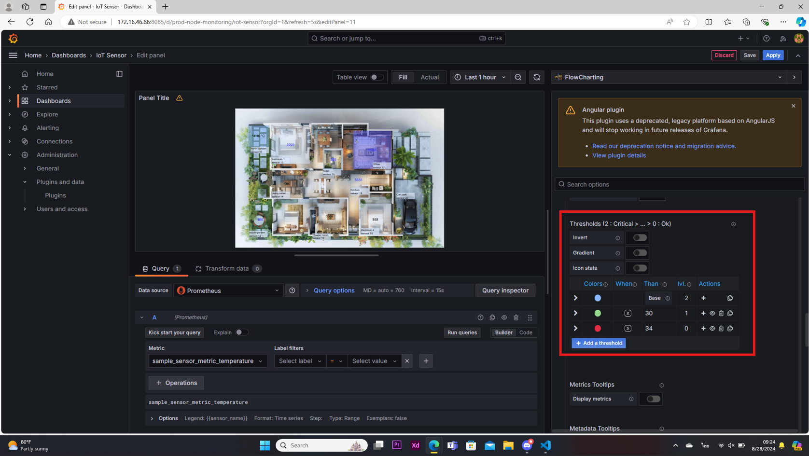
      </br> 

7. ทำการ duplicate Rules ให้ครบทุก sensors แล้วไปเปลี่ยน apply to metrics โดยเลือก sensor ตามที่เราต้องการ และเปลี่ยนที่ map บนแผนภาพ
</br>


</br> 

